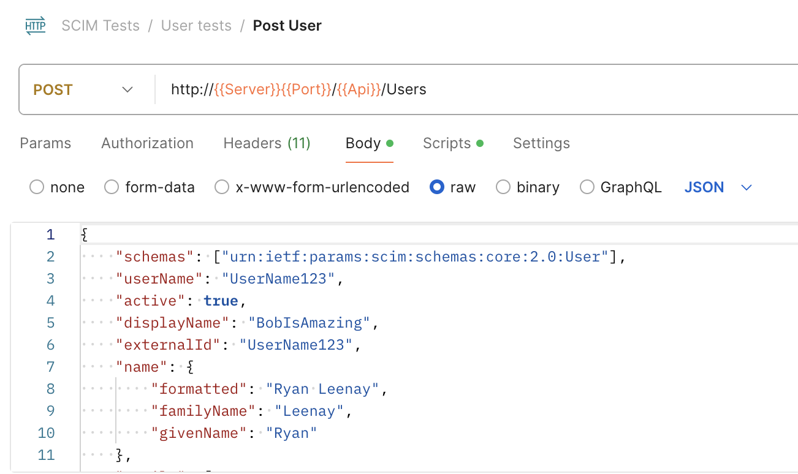

# SCIM Demo

This is a SCIM demo server written in Rails and based on the [scimitar](https://github.com/RIPAGlobal/scimitar) gem. It comes with a Postman collection of test requests to easily see SCIM in action.

## Setup

```bash
# Start Postgres DB
docker compose up

# Initialize DB
bin/rails db:create
bin/rails db:migrate

# Start server
bin/rails s
```

To send pre-made test requests to the SCIM server, import `postman/scim.json` into your Postman App.



## About SCIM

### Use Case of SCIM

System for Cross-domain Identity Management (SCIM) is a protocol that helps systems synchronize user data between different business systems. 
A service provider hosts a SCIM API endpoint implementation. One or more enterprise subscribers use these APIs to let that service know about changes in the enterprise's user (employee) list. 
The service that is provided is some kind of software-as-a-service solution that the enterprise subscriber uses to assist with their day to day business. 
The enterprise maintains its user (employee) list via whatever means it wants, but includes SCIM support so that any third party services it uses can be kept up to date with adds, removals or changes to employee data.

### Specification Details

[SCIM v2 RFC 7642: Concepts](https://datatracker.ietf.org/doc/html/rfc7642) <br>
[SCIM v2 RFC 7643: Core schema](https://datatracker.ietf.org/doc/html/rfc7643) <br>
[SCIM v2 RFC 7644: Protocol](https://datatracker.ietf.org/doc/html/rfc7644) <br>

### Core Schema

SCIM manages different resources like users and groups, and how they are represented in JSON is defined by a “Schema”.

- **Schema**: defines attributes, that is their name and data type as a JSON document. Each attribute has certain characteristics (Section 7), like whether it required or optional, whether the attribute can be overwritten, or returned in a response.
- **Resources**: also a JSON object (Section 3). It has a resource type, like “User”, schemas, which are schema URIs that point to the schema definitions. SCIM defines resources for “User” (Section 4.1) and “Group” (Section 4.2) for example.
- **ResourceTypeSchema**: the metadata about a resource type, that is name, description, its endpoint, schema, and schema extensions (Section 6).
- **Schema Extensions**: for example, “Enterprise User” is an extension of “User” and would have some additional attributes like the employee number.
- **Service Provider Configuration**: shows what features of SCIM the service provides and how they are configured. Are bulk operations supported? What filters are allowed for search queries? What are the supported authentication schemas?

### Protocol

The SCIM protocol defines a message and response format to query resources with GET, POST, PATCH, PUT and DELETE requests. Check out the provided postman collection to see examples for its request and reponse format!

- **Authentication and Authorization**: not specified by the SCIM standards, but think OAuth, so having a token with a scope that indicates what you are allowed to do. Note that it might be necessary to also support anonymous requests, in the case of user self registration for example.
- **Endpoints and Methods**: “Schemas” definitions can be retrieved at the `/Schemas` endpoint. Similarly, the service provider config can be found at `/ServiceProviderConfig`. Each resource has its own endpoint. Users have the the `/Users` endpoint and then you issue CRUD operations against that endpoint (Section 3), e.g., `GET /Users/<user-id>`.
- **Filtering and Pagination**: a standard set of query parameters are defined that can be used to filter, sort, and paginate (Section 3.4.2). SCIM supports very complex filtering options (Section 3.4.2.2). E.g., `filter = username Eq “john”`, so an attribute name followed by an operator, followed by an optional value.
- **Updating resources**: PATCH operations are used to update attributes of a resource via "add", "remove" or "replace" operations. The attribute to update is specified via the `path` argument. The path can contain complex query logic like `“path”:”addresses[type eq \”work\”]`.
- **Bulk operations**: send a potentially large collection of resource operations in a single request (Section 3.7). It is currently not supported by the [scimitar](https://github.com/RIPAGlobal/scimitar) gem.

